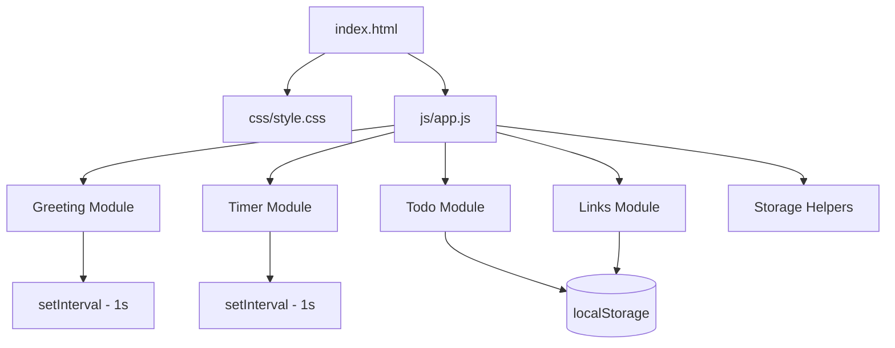

# Design Document: Personal Dashboard

## Overview

A single-page browser dashboard built with plain HTML, CSS, and vanilla JavaScript. It runs entirely client-side — no build step, no server, no dependencies. Four widgets are rendered on one page: a live greeting/clock, a focus countdown timer, a to-do list, and a quick links panel. All mutable state is persisted to `localStorage`.

The design goal is simplicity: one HTML file, one CSS file (`css/style.css`), one JS file (`js/app.js`). The JS is structured as a module-per-widget pattern inside a single file, each widget owning its own DOM queries, event listeners, and storage key.

---

## Architecture



**Execution flow:**
1. Browser parses `index.html`, loads `style.css` and `app.js` (deferred).
2. `DOMContentLoaded` fires; each module's `init()` is called in sequence.
3. Greeting starts a 1-second interval to update time/date/greeting text.
4. Timer registers button event listeners; no interval runs until Start is pressed.
5. Todo reads `localStorage`, renders saved tasks, registers form/list event listeners.
6. Links reads `localStorage`, renders saved links, registers form/list event listeners.

No module communicates with another. All state is local to each module's closure.

---

## Components and Interfaces

### Greeting Module

Responsible for the live clock, date, and contextual greeting.

```
greetingModule.init()
  - Queries: #greeting-text, #clock, #date
  - Starts setInterval(tick, 1000)
  - tick(): reads new Date(), updates all three elements

greetingText(hour: number): string
  - 5–11  → "Good morning"
  - 12–17 → "Good afternoon"
  - 18–4  → "Good evening"

formatTime(date: Date): string   → "HH:MM"
formatDate(date: Date): string   → "Monday, 14 July 2025"
```

### Timer Module

Manages the 25-minute countdown with start/stop/reset.

```
timerModule.init()
  - Queries: #timer-display, #btn-start, #btn-stop, #btn-reset
  - Registers click handlers

State (closure):
  remaining: number   // seconds, starts at 1500
  intervalId: number | null

start(): void   // ignored if intervalId !== null
stop(): void    // ignored if intervalId === null
reset(): void   // clears interval, sets remaining = 1500
tick(): void    // decrements remaining; if 0 → stop + notify

formatMMSS(seconds: number): string  → "MM:SS"
notify(): void  // Notification API if permitted, else on-page alert
```

### Todo Module

Manages the task list with add/edit/toggle/delete and localStorage persistence.

```
todoModule.init()
  - Reads tasks from localStorage
  - Renders task list
  - Registers: form submit, list click (delegated)

addTask(text: string): void
editTask(id: string, newText: string): void
toggleTask(id: string): void
deleteTask(id: string): void
save(): void   // JSON.stringify tasks → localStorage[STORAGE_KEY]
render(): void // rebuilds #todo-list innerHTML from tasks array
validate(text: string): boolean  // false if trim() === ""
```

### Links Module

Manages quick-link entries with add/delete and localStorage persistence.

```
linksModule.init()
  - Reads links from localStorage
  - Renders link buttons
  - Registers: form submit, panel click (delegated)

addLink(label: string, url: string): void
deleteLink(id: string): void
save(): void   // JSON.stringify links → localStorage[STORAGE_KEY]
render(): void // rebuilds #links-panel from links array
validateURL(url: string): boolean  // uses URL constructor; catches throws
```

### Storage Helpers

Thin wrappers used by Todo and Links modules.

```
storageGet(key: string): any       // JSON.parse(localStorage.getItem(key)) ?? []
storageSet(key: string, val: any)  // localStorage.setItem(key, JSON.stringify(val))
```

---

## Data Models

### Task

```json
{
  "id": "string (crypto.randomUUID or Date.now().toString())",
  "text": "string (non-empty, trimmed)",
  "done": "boolean"
}
```

Stored under localStorage key: `"pd_tasks"` as a JSON array.

### Link

```json
{
  "id": "string",
  "label": "string (non-empty, trimmed)",
  "url": "string (valid URL)"
}
```

Stored under localStorage key: `"pd_links"` as a JSON array.

### Timer State

Not persisted. Lives entirely in the Timer module's closure. Resets to 1500 on every page load.

---

## Correctness Properties

*A property is a characteristic or behavior that should hold true across all valid executions of a system — essentially, a formal statement about what the system should do. Properties serve as the bridge between human-readable specifications and machine-verifiable correctness guarantees.*

### Property 1: Greeting text covers all hours

*For any* integer hour in the range 0–23, `greetingText(hour)` SHALL return exactly one of "Good morning", "Good afternoon", or "Good evening", and the result SHALL match the correct bucket: hours 5–11 → "Good morning", hours 12–17 → "Good afternoon", hours 0–4 and 18–23 → "Good evening".

**Validates: Requirements 1.3, 1.4, 1.5**

### Property 2: Clock format invariant

*For any* `Date` object, `formatTime(date)` SHALL return a string matching the pattern `HH:MM` (two-digit hour, colon, two-digit minute).

**Validates: Requirements 1.1**

### Property 3: Timer countdown monotonicity

*For any* starting value `N` in 1–1500, each call to `tick()` SHALL decrease `remaining` by exactly 1, and `remaining` SHALL never go below 0. When `remaining` reaches 0, the timer SHALL stop and trigger a notification.

**Validates: Requirements 2.2, 2.5, 2.6**

### Property 4: Timer start/stop idempotence

*For any* running timer state (intervalId !== null), calling `start()` again SHALL leave `intervalId` unchanged. *For any* stopped timer state (intervalId === null), calling `stop()` SHALL leave the state unchanged.

**Validates: Requirements 2.7, 2.8**

### Property 5: Task addition and persistence round-trip

*For any* non-empty task text string, after calling `addTask(text)` and `save()`, deserializing from localStorage SHALL yield an array containing a task with `text` equal to the trimmed input and `done` equal to `false`. Furthermore, for any sequence of add/edit/toggle/delete operations, the array serialized to localStorage SHALL be identical to the array deserialized from it (JSON round-trip identity).

**Validates: Requirements 3.1, 3.8, 3.9**

### Property 6: Whitespace input rejection

*For any* string composed entirely of whitespace characters (including the empty string), `validate(text)` SHALL return `false`, and neither the task list nor the links list SHALL be modified by an attempted add using that string.

**Validates: Requirements 3.2, 3.5**

### Property 7: Task toggle round-trip

*For any* task with completion state `done`, calling `toggleTask(id)` twice SHALL restore `done` to its original value.

**Validates: Requirements 3.6**

### Property 8: Link addition and persistence round-trip

*For any* valid label and URL, after calling `addLink(label, url)` and `save()`, deserializing from localStorage SHALL yield an array containing a link with matching `label` and `url`. Furthermore, for any sequence of add/delete operations, the array serialized to localStorage SHALL be identical to the array deserialized from it (JSON round-trip identity).

**Validates: Requirements 4.1, 4.5, 4.6**

### Property 9: Invalid URL rejection

*For any* string that the `URL` constructor throws on (i.e., is not a valid URL), `validateURL(url)` SHALL return `false`, and the links list SHALL remain unchanged after an attempted add using that string.

**Validates: Requirements 4.2**

---

## Error Handling

| Scenario | Handling |
|---|---|
| `localStorage` unavailable (private mode quota exceeded) | `storageSet` wraps in try/catch; logs warning; UI continues without persistence |
| `JSON.parse` fails on corrupt storage data | `storageGet` returns `[]` on parse error |
| `Notification` API not permitted | `notify()` falls back to an on-page `<div role="alert">` banner |
| `URL` constructor throws on invalid URL input | `validateURL` returns `false`; inline error message shown |
| Empty/whitespace task or link label | `validate` returns `false`; inline error message shown |
| Timer `tick` called after `remaining` already 0 | Guard clause: `if (remaining <= 0) return` |

---

## Testing Strategy

### Unit Tests (example-based)

Focus on concrete scenarios and edge cases:

- `greetingText` returns correct string for boundary hours (5, 12, 18, 4)
- `formatTime` pads single-digit hours and minutes correctly (e.g., `01:05`)
- `formatDate` produces the expected human-readable string
- `formatMMSS` pads correctly for values like 0, 60, 1500
- `validate("")` and `validate("   ")` both return `false`
- `validateURL("not-a-url")` returns `false`, `validateURL("https://example.com")` returns `true`
- `storageGet` returns `[]` when key is absent or data is corrupt
- Timer `reset()` restores `remaining` to 1500 and clears any active interval

### Property-Based Tests

Using a property-based testing library (e.g., **fast-check** for JavaScript), with a minimum of **100 iterations per property**:

Each test is tagged with:
`// Feature: personal-dashboard, Property N: <property text>`

- **Property 1** — Generate arbitrary hours 0–23; assert `greetingText` returns the correct greeting for each bucket.
- **Property 2** — Generate arbitrary `Date` objects; assert `formatTime` output matches `/^\d{2}:\d{2}$/`.
- **Property 3** — Generate `N` in range 1–1500; simulate N `tick()` calls; assert `remaining` decrements correctly, never goes negative, and stops + notifies at 0.
- **Property 4** — Start timer, call `start()` again; assert `intervalId` unchanged. With stopped timer, call `stop()`; assert state unchanged.
- **Property 5** — Generate arbitrary non-empty strings; add task, save, reload from storage; assert round-trip equality and `done === false`.
- **Property 6** — Generate arbitrary whitespace-only strings; assert `validate` returns `false` and list is unchanged.
- **Property 7** — Generate tasks with arbitrary `done` state; toggle twice; assert `done` is restored.
- **Property 8** — Generate arbitrary valid labels and URLs; add link, save, reload; assert round-trip equality.
- **Property 9** — Generate arbitrary non-URL strings; assert `validateURL` returns `false` and list is unchanged.

### Integration / Smoke Tests

- Dashboard loads in browser with no console errors (smoke)
- All four widgets render on page load (smoke)
- Tasks and links survive a simulated page reload (integration: write to localStorage, re-init modules, assert DOM reflects saved data)
- Timer reaches 00:00 and triggers notification/alert (integration: fast-forward with fake timers)
